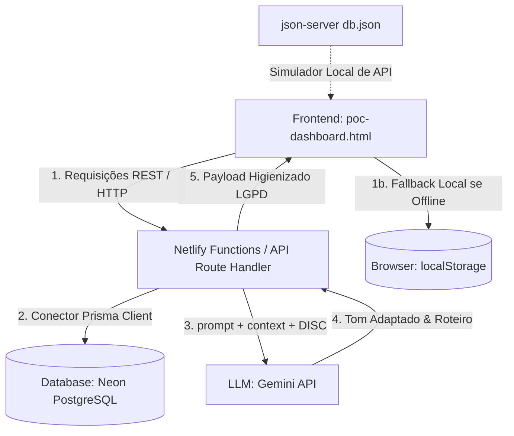
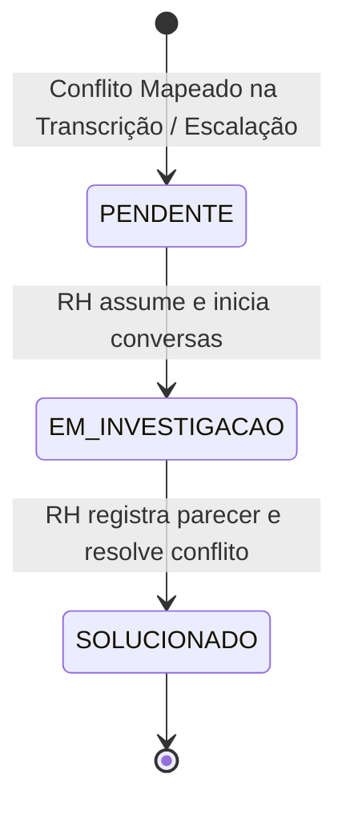

# Guia e Blueprint de Arquitetura do Projeto - SyncHR (Smart Leading)

Este documento consolidado serve como a especificação de engenharia, produto e compliance mais detalhada do ecossistema **SyncHR (Smart Leading)** da Clear IT. Ele descreve a estrutura de código, as tecnologias utilizadas, as regras de negócio, as conformidades regulatórias e a jornada cronológica de uso de ponta a ponta.

---

## 1. Visão Geral do Produto e Objetivos Estratégicos

O **Smart Leading (Clear One IA)** é o copiloto de inteligência artificial corporativo da Clear IT, criado em 2026 para responder ao tema estratégico anual **"Adaptabilidade, Performance e Resultado"**. 

Ele atua nas seguintes dores:
*   **eNPS e Engajamento:** Reverter a queda na dimensão "Liderança e Confiança" diagnosticada na pesquisa de clima 2025/2026.
*   **Distribuição Geográfica:** Conectar gestores e colaboradores distribuídos entre Manaus, São Paulo, Brasília, Rio de Janeiro, Salvador e Santa Catarina por meio de conversas de feedback e 1:1s frequentes.
*   **Maturidade de Gestão:** Apoiar líderes na condução de conversas difíceis (desalinhamento, performance) e na formulação de Planos de Desenvolvimento Individual (PDIs) assertivos.
*   **Visibilidade de Dados:** Trazer centralização e transparência das interações para o RH da Clear IT (Gerente Priscila Bacelar), eliminando o "improviso sistemático" e os registros perdidos.

---

## 2. Estrutura de Arquivos e Componentes do Repositório

O projeto adota o padrão **Onion Portable**, organizando as camadas lógicas entre especificações legíveis por máquina/humanos (Spec-as-Code) e componentes funcionais.

```text
SyncHR/
│
├── .gitignore                          # Exclusões de arquivos temporários, build e banco de dados mockado
├── LICENSE                             # Licença MIT
├── ONION-MASTER-PROMPT.md              # O Cérebro Orquestrador - Regula as personas da IA (@product, @engineer, @meta, @docs)
├── README.md                           # Instruções de instalação, script npm e setup local
├── PROJECT-GUIDE.md                    # Este arquivo - O Blueprint mestre do projeto
├── poc-dashboard.html                  # Painel Web Completo de PoC (HTML5/CSS3/Vanilla JS) contendo todas as simulações
├── presentation.html                   # Apresentação de slides interativa da metodologia Onion e do Smart Leading
├── smart-leading-dashboard-mockup.png  # Design Mockup de UI em alta resolução para visualização
│
├── docs/                               # Pasta Centralizadora de Contexto de Desenvolvimento
│   ├── business-context-lite.md        # Especificações de Produto (@product): Histórias de usuário, critérios de aceite e RNs
│   ├── technical-context-lite.md       # Arquitetura de Engenharia (@engineer): Modelagem Prisma, APIs, algoritmos e conformidades
│   ├── business-technical-lite.md      # Consolidação unificada de MVP para apresentação comercial com o RH
│   ├── onion-cycles.md                 # Fluxograma dos Ciclos Onion (Produto, Engenharia, KB e Sincronismo)
│   │
│   ├── knowledge-base/                 # Base de Conhecimento Científico e Pesquisas (@meta)
│   │   ├── one-on-one-and-feedback-methodologies.md # Padrões de feedback SBI, GROW e perfis de liderança
│   │   └── disc-and-lgpd-compliance.md              # Pesquisa detalhada de DISC, segurança legal LGPD e transmissão
│   │
│   └── sessions/                       # Logs históricos de desenvolvimento do projeto
│       ├── README.md                   # Índice cronológico das sessões
│       └── TEMPLATE.md                 # Estrutura padrão de relatório de sessão
│
└── scratch/                            # Rascunhos e scripts executáveis de validação
    └── poc-test-logic.js               # Código de teste isolado (lógicas da RN01, RN02 e filtro LGPD)
```

---

## 3. Arquitetura Tecnológica e Fluxo de Dados

A arquitetura do SyncHR é projetada para ser robusta, portátil e resiliente. O diagrama abaixo representa o fluxo de dados entre o Frontend, a API Serverless e o Banco de Dados:



### Detalhamento da Stack:
1.  **Next.js App Router & Server Actions:** Garante que chaves de API da LLM e strings de conexão de banco de dados fiquem expostas apenas no servidor, rodando como funções serverless no Netlify.
2.  **Prisma ORM & PostgreSQL:** Modelagem estruturada com migrations para consistência de dados.
3.  **json-server (Porta 3000):** Utiliza um arquivo local `db.json` para expor rotas REST (`GET`, `POST`, `PATCH`, `DELETE`) para simular o comportamento de gravação e atualização de dados no banco relacional.
4.  **Fallback de Armazenamento do Frontend:** O JavaScript no frontend monitora as conexões com o `json-server` via blocos `try/catch`. Caso o servidor local esteja inativo, os registros de 1:1, transcrições e conflitos são mantidos no `localStorage` do navegador para assegurar que a demonstração seja 100% autônoma e interativa.

---

## 4. Jornada Cronológica de Uso e Fluxos Detalhados

A usabilidade do sistema segue uma ordem cronológica precisa, desde a preparação inicial da liderança até a governança de dados do RH.

### Passo 1: Onboarding e Coleta de Perfil (F-01 e F-02)

O líder e o colaborador respondem a um questionário comportamental para calibrar a inteligência do copiloto.

#### A. O Questionário DISC de Onboarding (Mini-Quiz de 4 Perguntas):
O preenchimento avalia a reação do colaborador a diferentes situações profissionais:
1.  *Decisões Rápidas:* 
    *   (a) Prefiro agir de imediato para resolver logo. (**D**)
    *   (b) Gosto de debater as ideias com a equipe. (**I**)
    *   (c) Prefiro analisar o histórico e planejar o processo. (**S**)
    *   (d) Preciso de dados e especificações precisas antes de agir. (**C**)
2.  *Sob Pressão:*
    *   (a) Fico impaciente e foco 100% no resultado. (**D**)
    *   (b) Tento usar o carisma para aliviar o clima. (**I**)
    *   (c) Tento manter a calma e seguir o plano estabelecido. (**S**)
    *   (d) Torno-me extremamente focado nos detalhes e regras. (**C**)
3.  *Trabalho em Equipe:*
    *   (a) Gosto de liderar as decisões e delegar. (**D**)
    *   (b) Valorizo a interação social e a empolgação. (**I**)
    *   (c) Gosto de colaborar e manter a estabilidade do grupo. (**S**)
    *   (d) Prefiro trabalhar de forma independente com metas claras. (**C**)
4.  *Feedback:*
    *   (a) Prefiro que me digam a verdade nua e crua diretamente. (**D**)
    *   (b) Preciso sentir que meu esforço é reconhecido socialmente. (**I**)
    *   (c) Preciso de orientações calmas que deem segurança na evolução. (**S**)
    *   (d) Exijo dados, métricas e análises objetivas sobre o meu desvio. (**C**)

#### B. Definição do Perfil de Liderança:
O líder é classificado para que a IA adapte sua linguagem e profundidade:
*   **Líder Técnico:** IA responde com pautas e roteiros rápidos, sem rodeios e sem jargões corporativos.
*   **Líder em Transição:** IA fornece guias passo a passo, conselhos comportamentais de inteligência emocional e a metodologia de feedback SBI (Situação, Comportamento, Impacto).
*   **Líder Engajado:** IA foca na velocidade de preenchimento, geração de combinados rápidos e acompanhamento de metas de PDI.

---

### Passo 2: Seleção de Colaborador e Sugestão de Tópicos por Perfil (F-02)

Quando o líder entra na tela de preparação de uma nova 1:1, ele escolhe o colaborador. O sistema busca no banco o perfil DISC do colaborador e exibe sugestões de tópicos de início:

*   **Liderado Dominante/Executor (D):**
    1.  *Alinhamento de Entregas:* "Quais são os gargalos que estão travando a velocidade da sua entrega na sprint?"
    2.  *Desafios e Autonomia:* "Qual projeto ou tecnologia você gostaria de liderar na próxima quinzena?"
*   **Liderado Influente/Comunicador (I):**
    1.  *Conexão e Clima:* "Como você sente que a dinâmica e a harmonia do time têm impactado a sua motivação?"
    2.  *Reconhecimento:* "Vamos conversar sobre o impacto positivo da sua última entrega no time."
*   **Liderado Estável/Planejador (S):**
    1.  *Segurança e Processo:* "O ritmo atual das sprints está saudável ou você tem sentido sobrecarga física/mental?"
    2.  *Previsibilidade:* "As metas do projeto estão claras ou precisamos alinhar melhor os processos?"
*   **Liderado Analítico/Conforme (C):**
    1.  *Qualidade e Fatos:* "Vamos revisar as métricas de qualidade de código e o que podemos melhorar na cobertura de testes."
    2.  *Especialização:* "Onde você enxerga que podemos dar mais profundidade técnica na sua arquitetura atual?"

---

### Passo 3: Preparação do Roteiro (< 3 Minutos) (F-03)

O líder escolhe o tema, o contexto da conversa e clica em **Gerar Roteiro**. O sistema carrega o **Prompt do Copiloto** correspondente ao perfil do líder cadastrado no banco:

```text
PROMPT DE GERAÇÃO (Exemplo para Líder em Transição):
"Você é o copiloto de IA Smart Leading. Gere um roteiro passo a passo detalhado para uma reunião de 1:1 com um colaborador de perfil {DISC} utilizando a metodologia SBI (Situação, Comportamento, Impacto). Forneça dicas de inteligência emocional e perguntas de empatia para o líder recém-promovido."
```

O roteiro é exibido na tela contendo tempos sugeridos para cada etapa da conversa.

---

### Passo 4: Condução da 1:1 e Copiloto Live (F-03)

Durante a conversa, o líder pode manter o painel de assistência ativo.
*   O líder insere a fala em tempo real do colaborador no chat auxiliar.
*   A IA (simulada ou via API) responde com conselhos baseados no perfil do colaborador.
    *   *Exemplo:* O colaborador diz: "Estou me sentindo muito sobrecarregado."
    *   *Conselho da IA para Líder Técnico:* "Sugira fatiar o backlog e pergunte diretamente qual tarefa pode ser priorizada ou adiada."
    *   *Conselho da IA para Líder em Transição:* "O colaborador possui perfil Estável (S) e quer se sentir seguro. Diga que compreende o momento, valide a sobrecarga e construam juntos um plano de divisão de demandas."

---

### Passo 5: Transcrição, Opt-in LGPD e Persistência no Banco (F-06)

Ao final do diálogo, o líder registra a transcrição completa ou pontos chaves discutidos.
*   **Controle LGPD (Opt-in):** O sistema exige a marcação do checkbox de consentimento do colaborador ("O colaborador declarou estar ciente e consentiu com o registro desta transcrição").
*   **Validação de Privacidade (Sanitização):** O texto passa por uma validação interna antes do envio à LLM ou salvamento:
    *   *Padrão de CPFs:* `/\b\d{3}\.?\d{3}\.?\d{3}-?\d{2}\b/g` (identificado e removido).
    *   *Padrão de E-mails:* `/\b[A-Za-z0-9._%+-]+@[A-Za-z0-9.-]+\.[A-Z|a-z]{2,}\b/g` (identificado e removido).
    *   *Blacklist de Termos Sensíveis de RH:* `["atestado", "médico", "saúde", "advertência nominal", "doença"]` (são bloqueados para evitar vazamento de dados de saúde do trabalhador).
*   **Envio da Requisição REST:**
    *   O frontend faz um `POST /oneOnOnes` enviando a transcrição e metadados.
    *   Os dados são gravados estruturadamente no banco Postgres/`db.json`.

---

### Passo 6: Avaliação Pós-1:1 e Aprendizado do Modelo (F-06)

Assim que a 1:1 é arquivada, o sistema aciona uma rotina secundária de IA:
1.  **Avaliação do Roteiro vs. Transcrição:** O modelo avalia se as metas acordadas foram de fato documentadas.
2.  **Geração de Recomendações de Eficiência:** A IA sugere temas que deveriam ter sido explorados com mais profundidade (Ex: "A conversa focou muito em código, mas o liderado havia sinalizado cansaço físico. Na próxima 1:1, investigue o bem-estar.").
3.  **Loop de Aprendizado:** As sugestões pós-1:1 e as preferências de comunicação são adicionadas ao campo `feedbackHistory` do colaborador no banco de dados, calibrando a IA para sugerir pautas ainda mais assertivas na próxima preparação de pauta.

---

### Passo 7: Varredura Automática de Conflitos e Escalação (F-05 e F-06)

Paralelamente, a transcrição salva passa por um analisador de sentimentos para mapeamento de conflitos corporativos.

#### A. Mapeador de Conflitos:
O texto da transcrição é avaliado contra um dicionário léxico de atrito:
*   *Palavras de Alerta:* `["sobrecarregado", "atrito", "conflito", "demissão", "injusto", "desgaste", "briga", "pressão", "cobrando", "promessa", "desrespeito"]`.
*   *Pontuação de Criticidade:* Se a contagem de termos de alerta for $\ge 2$, ou se a análise de sentimento da LLM retornar risco alto, um registro é criado na coleção `conflicts` com o status `PENDING`.

#### B. Painel de Conflitos do RH (Aba Exclusiva):
Apenas usuários autenticados com o perfil de RH visualizam a aba de Conflitos.



*   **Usabilidade do Fluxo de Resolução:**
    1.  O analista de RH clica no protocolo do conflito.
    2.  O sistema exibe o histórico de 1:1s e o histórico do colaborador (respeitando a LGPD e sem exibir transcrições brutas para manter a privacidade do diálogo líder-liderado, a menos que autorizado).
    3.  O RH altera o status do conflito para `EM_INVESTIGACAO` e registra notas internas.
    4.  Após a mediação, o RH preenche um checklist de fechamento:
        *   [x] Reunião de mediação realizada.
        *   [x] Acordo de convivência assinado ou plano de ação traçado.
        *   [x] Repactuação de capacidade/prazos com o gestor efetuada.
    5.  O RH insere o parecer final, marca o conflito como `SOLUCIONADO`, e o registro é atualizado no banco via `PATCH /conflicts/:id`.

---

### Passo 8: Painel Administrativo de Prompts (F-06)

Permite aos administradores monitorar e gerenciar a IA sem alteração de código:
*   **Edição do Prompt Modelo (Fine-Tuning):** O administrador edita o prompt que orienta a IA na geração de roteiros e conselhos.
*   **Versionamento:** O prompt alterado é salvo na tabela `prompts` do banco. Ao rodar o endpoint `/oneOnOnes/generate`, o sistema injeta o prompt mais recente registrado no banco no contexto do Gemini.
*   **Compliance de Transmissão Externa:** Permite a exportação de relatórios estatísticos de clima anonimizados para parceiros de auditoria organizacional, aplicando:
    *   mTLS no transporte.
    *   Hash SHA-256 com salt nas chaves do colaborador para evitar rastreabilidade nominativa.
    *   Criptografia simétrica AES-256-GCM para payloads.

---

## 5. Regras de Negócio e Validações de Compliance

Para manter a governança do processo, o SyncHR aplica rigorosas travas de sistema:

1.  **RN01 (Regra de Histórico de 45 dias):**
    Para abrir uma mediação comum de conflito no RH, o sistema faz uma consulta no banco para validar se existe pelo menos uma reunião de 1:1 registrada entre o líder e o colaborador nos últimos 45 dias. Caso contrário, a solicitação é recusada com orientação de conversa direta prévia.
2.  **RN02 (Desvio Grave / Bypass de Ética):**
    Denúncias graves de assédio moral, assédio sexual, racismo ou quebra de código de ética ignoram a barreira de 45 dias da RN01. A escalação é permitida imediatamente, ocultando os logs normais de 1:1 e gerando um alerta de alta prioridade criptografado direto para a gerência de RH.
3.  **RN03 (Segurança LGPD):**
    Qualquer dado que descumpra a higienização de PII ou dados sensíveis de saúde é removido do processamento antes de atingir os servidores externos de inteligência artificial.
4.  **RBAC (Controle de Acesso Baseado em Função):**
    *   *Líder:* Pode criar onboarding, gerar roteiros, simular chat do copiloto e visualizar o histórico de 1:1s de seus próprios liderados. Não visualiza outras áreas nem a aba do RH.
    *   *RH:* Visualiza consolidados estatísticos de todas as áreas, painel de conflitos e realiza mediações.
    *   *Administrador:* Acessa configurações globais e edição de prompts (Fine-tuning admin panel).
5.  **Audit Log de Visualização:**
    Toda vez que uma ficha de colaborador ou log de conflito é acessado no painel, o backend registra uma linha na tabela `audit_logs` gravando: `DateTime`, `UserRole`, `ActionType` e `TargetCollaboratorID`.
