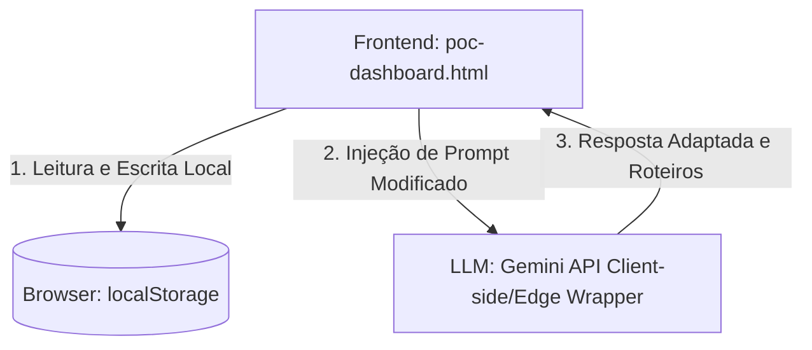

# Guia e Blueprint de Arquitetura do Projeto - SyncHR (Smart Leading)

Este documento consolidado serve como a especificação de engenharia, produto e compliance mais detalhada do ecossistema **SyncHR (Smart Leading)** da Clear IT. Ele descreve a estrutura de código, as tecnologias utilizadas, as regras de negócio, as conformidades regulatórias, os comandos padrões e a jornada cronológica de uso de ponta a ponta.

---

## 1. Visão Geral do Produto e Objetivos Estratégicos

O **Smart Leading (Clear One IA)** é o copiloto de inteligência artificial corporativo da Clear IT, criado em 2026 para responder ao tema estratégico anual **"Adaptabilidade, Performance e Resultado"**. 

Ele atua nas seguintes dores:
*   **eNPS e Engajamento:** Reverter a queda na dimensão "Liderança e Confiança" diagnosticada na pesquisa de clima 2025/2026.
*   **Distribuição Geográfica:** Conectar gestores e colaboradores distribuídos entre Manaus, São Paulo, Brasília, Rio de Janeiro, Salvador e Santa Catarina por meio de conversas de feedback e 1:1s frequentes.
*   **Maturidade de Gestão:** Apoiar líderes na condução de conversas difíceis (desalinhamento, performance) e na formulação de Planos de Desenvolvimento Individual (PDIs) assertivos.
*   **Visibilidade de Dados:** Trazer centralização e transparência das interações para o RH da Clear IT (Gerente Priscila Bacelar), eliminando o "improviso sistemático" e os registros perdidos.

---

## 2. Estrutura de Arquivos e Componentes do Repositório

O projeto adota o padrão **Onion Portable**, organizando as camadas lógicas entre especificações legíveis por máquina/humanos (Spec-as-Code) e componentes funcionais.

```text
SyncHR/
│
├── .gitignore                          # Exclusões de arquivos temporários, build e relatórios locais
├── LICENSE                             # Licença MIT
├── ONION-MASTER-PROMPT.md              # O Cérebro Orquestrador - Regula as personas da IA (@pm, @frontend, @backend, @security, @testing, @validator)
├── README.md                           # Instruções de instalação, comandos de serve e testes locais
├── PROJECT-GUIDE.md                    # Este arquivo - O Blueprint mestre do projeto
├── poc-dashboard.html                  # Painel Web Completo de PoC (HTML5/CSS3/Vanilla JS) contendo todas as simulações
├── presentation.html                   # Apresentação de slides interativa da metodologia Onion e do Smart Leading
├── smart-leading-dashboard-mockup.png  # Design Mockup de UI em alta resolução para visualização
│
├── docs/                               # Pasta Centralizadora de Contexto de Desenvolvimento
│   ├── business-context-lite.md        # Especificações de Produto (@pm): Histórias de usuário, critérios de aceite e RNs (Não-Tech)
│   ├── technical-context-lite.md       # Arquitetura de Engenharia (@backend/@frontend/@security/@testing): Mocks, local storage e testes (Tech)
│   ├── business-technical-lite.md      # Consolidação unificada de MVP para apresentação comercial com o RH
│   ├── onion-cycles.md                 # Fluxograma dos Ciclos Onion (Produto, Engenharia, KB e Sincronismo)
│   │
│   ├── knowledge-base/                 # Artigos de Pesquisa e Bases de Conhecimento (@meta)
│   │   ├── one-on-one-and-feedback-methodologies.md # Padrões de feedback SBI, GROW e perfis de liderança
│   │   └── disc-and-lgpd-compliance.md              # Pesquisa detalhada de DISC, segurança legal LGPD e transmissão
│   │
│   └── sessions/                       # Logs históricos de desenvolvimento do projeto
│       ├── README.md                   # Índice cronológico das sessões
│       └── TEMPLATE.md                 # Estrutura padrão de relatório de sessão
│
└── scratch/                            # Rascunhos e scripts executáveis de validação
    └── poc-test-logic.js               # Código de teste isolado (lógicas da RN01, RN02 e filtro LGPD)
```

---

## 3. Arquitetura Tecnológica e Fluxo de Dados

A arquitetura do SyncHR é projetada para ser robusta, portátil e resiliente, utilizando uma infraestrutura **100% cliente-side** (sem dependências de servidores PostgreSQL ou contêineres de banco externos):



### Detalhamento da Stack:
1.  **Next.js (App Router):** Utilizado para renderização estática rápida. Os componentes dinâmicos são implementados como Client Components para manter a reatividade da interface.
2.  **Mock Storage Manager (`lib/storage.ts`):** Camada de abstração JavaScript que lê, valida e grava as strings JSON no `localStorage` do navegador, mantendo o estado da aplicação persistente entre atualizações de página.
3.  **Gemini API Integration:** Chamadas encapsuladas e higienizadas para as APIs da LLM, recebendo os metadados do líder e do colaborador para gerar conselhos.

---

## 4. Subagentes Especialistas do Onion Master Prompt

O desenvolvimento e a manutenção do SyncHR são divididos entre subagentes com focos especializados:

*   **@pm / @po (Planejador / Product Manager):** Foca em planejar "O que e por quê" (priorização de backlog, dores do cliente, histórias de usuário, requisitos funcionais e o onboarding estruturado de líderes/colaboradores).
*   **@frontend / @front (Desenvolvimento Frontend):** Foca em UI/UX, boas práticas de layout (responsividade, grid, flexbox, consistência visual) e acessibilidade na web (diretrizes WCAG, tags ARIA, contraste cromático apropriado e navegação por teclado).
*   **@backend / @back (Desenvolvimento Backend):** Foca na modelagem lógica, simulação de banco de dados mockado localmente (`localStorage`), integrações de APIs e lógica de dados.
*   **@security / @sec (Segurança da Informação):** Foca em privacidade, conformidade LGPD, higienização de inputs contra PII (dados pessoais identificáveis) e dados de saúde sensíveis, além de qualidade de código defensiva (regras OWASP).
*   **@testing / @qa (Qualidade e Testes):** Foca em planos de testes automatizados (unitários via Vitest, E2E via Playwright) e validações limite de regras de negócio.
*   **@validator / @audit (Auditor de Validações):** Persona integradora que audita sistematicamente todas as camadas de validação (frontend, backend, testes de QA e cybersecurity).

---

## 5. Jornada Cronológica de Uso e Fluxos Detalhados

A usabilidade do sistema segue uma ordem cronológica precisa, desde a preparação inicial da liderança até a governança de dados do RH.

### Passo 1: Onboarding Estruturado (F-01 e F-02)

O onboarding é um fluxo obrigatório e estruturado para mapear os dados necessários antes do início das agendas:

#### A. Onboarding do Líder:
O líder acessa a interface de configuração inicial e cadastra:
1.  *Cargo Atual e Nível de Destino:* (Ex: Coordenador $\rightarrow$ Gerente).
2.  *Perfil de Liderança:* Determina se o líder é **Técnico** (IA enxuta), **Em Transição** (IA detalhada com SBI) ou **Engajado** (IA rápida baseada em PDI). Os dados são persistidos sob a chave `synchr_leader_profile` no `localStorage`.

#### B. Onboarding do Colaborador & Questionário DISC:
O colaborador responde ao questionário comportamental de 4 perguntas para mapeamento comportamental (ou o líder preenche de forma simulada):
1.  *Decisões Rápidas:*
    *   (a) Prefiro agir de imediato para resolver logo. (**Dominância**)
    *   (b) Gosto de debater as ideias com a equipe. (**Influência**)
    *   (c) Prefiro analisar o histórico e planejar o processo. (**Estabilidade**)
    *   (d) Preciso de dados e especificações precisas antes de agir. (**Conformidade**)
2.  *Sob Pressão:*
    *   (a) Fico impaciente e foco no resultado. (**Dominância**)
    *   (b) Tento usar o carisma para aliviar o clima. (**Influência**)
    *   (c) Tento manter a calma e seguir o plano. (**Estabilidade**)
    *   (d) Foco obsessivamente nas regras e detalhes. (**Conformidade**)
3.  *Trabalho em Equipe:*
    *   (a) Gosto de liderar as decisões e delegar. (**Dominância**)
    *   (b) Valorizo a interação social e a empolgação. (**Influência**)
    *   (c) Gosto de colaborar de forma previsível e estável. (**Estabilidade**)
    *   (d) Prefiro trabalhar de forma independente. (**Conformidade**)
4.  *Recepção de Feedbacks:*
    *   (a) Prefiro críticas diretas e sem rodeios. (**Dominância**)
    *   (b) Preciso de validação e reconhecimento social. (**Influência**)
    *   (c) Exijo um tom calmo que transmita segurança na evolução. (**Estabilidade**)
    *   (d) Exijo métricas estruturadas e fatos concretos. (**Conformidade**)

Os dados são salvos na coleção de liderados (chave `synchr_collaborators`).

---

### Passo 2: Seleção de Colaborador e Sugestão de Tópicos por Perfil (F-02)

Quando o líder entra na tela de preparação de uma nova 1:1, ele escolhe o colaborador. O sistema busca no banco local o perfil DISC do colaborador e exibe sugestões de tópicos de início:

*   **Liderado Dominante/Executor (D):**
    1.  *Alinhamento de Entregas:* "Quais são os gargalos que estão travando a velocidade da sua entrega na sprint?"
    2.  *Desafios e Autonomia:* "Qual projeto ou tecnologia você gostaria de liderar na próxima quinzena?"
*   **Liderado Influente/Comunicador (I):**
    1.  *Conexão e Clima:* "Como você sente que a dinâmica e a harmonia do time têm impactado a sua motivação?"
    2.  *Reconhecimento:* "Vamos conversar sobre o impacto positivo da sua última entrega no time."
*   **Liderado Estável/Planejador (S):**
    1.  *Segurança e Processo:* "O ritmo atual das sprints está saudável ou você tem sentido sobrecarga física/mental?"
    2.  *Previsibilidade:* "As metas do projeto estão claras ou precisamos alinhar melhor os processos?"
*   **Liderado Analítico/Conforme (C):**
    1.  *Qualidade e Fatos:* "Vamos revisar as métricas de qualidade de código e o que podemos melhorar na cobertura de testes."
    2.  *Especialização:* "Onde você enxerga que podemos dar mais profundidade técnica na sua arquitetura atual?"

---

### Passo 3: Preparação do Roteiro (< 3 Minutos) (F-03)

O líder escolhe o tema, o contexto da conversa e clica em **Gerar Roteiro**. O sistema carrega o prompt global armazenado na chave `synchr_prompts`, injetando os perfis calibrados para gerar o roteiro e os tempos sugeridos de fala e escuta.

---

### Passo 4: Condução da 1:1 e Copiloto Live (F-03)

Durante a conversa, o painel "Live Assist" fornece 2 a 3 sugestões de perguntas imediatas de aprofundamento empático para ajudar o líder a manter a escuta ativa baseada nas respostas em tempo real do liderado (Regra 70/30: colaborador fala 70% do tempo).

---

### Passo 5: Transcrição, Opt-in LGPD e Persistência no LocalStorage (F-06)

Ao final da conversa, o líder registra a ata ou transcrição:
1.  **Opt-in LGPD:** O sistema exige a marcação do consentimento de registro do colaborador.
2.  **Validação de Privacidade (Sanitização):** O texto é inspecionado localmente antes de qualquer processamento para remover CPFs, e-mails e blacklist de termos médicos/saúde.
3.  **Persistência:** A transcrição é gravada na chave `synchr_one_on_ones` do `localStorage`.

---

### Passo 6: Avaliação Pós-1:1 e Aprendizado do Modelo (F-06)

Assim que a 1:1 é arquivada, o sistema aciona uma rotina secundária de IA local:
1.  **Avaliação do Roteiro vs. Transcrição:** Avalia a aderência do líder e propõe melhorias.
2.  **Loop de Aprendizado:** As sugestões pós-1:1 e as preferências de comunicação são injetadas no histórico local do colaborador (`feedbackHistory`), refinando as sugestões do passo 2 nos próximos ciclos.

---

### Passo 7: Mapeamento de Conflitos e Ação do RH (F-05 e F-06)

*   **Detecção Automática:** A transcrição é varrida por um dicionário léxico de atrito (`["sobrecarregado", "atrito", "desgaste", "briga", "injusto"]`). Ao detectar criticidade alta, cria um registro na aba do RH com a chave `synchr_conflicts` (Status: `PENDING`).
*   **Mediação do RH:** Priscila Bacelar visualiza os conflitos, altera o status para `EM_INVESTIGACAO`, realiza as reuniões, preenche o checklist de mediação e finaliza o caso marcando como `SOLUCIONADO`.

---

### Passo 8: Painel Administrativo de Prompts (Fine-Tuning) (F-06)

O administrador acessa a tela de configurações, lê e edita o Prompt de Sistema diretamente na chave `synchr_prompts` do `localStorage`, ajustando diretrizes gerais operacionais do modelo instantaneamente.

---

## 6. Comandos Padrões de Execução e Testes

Para facilitar e manter a qualidade do código e os padrões de validação auditados, o desenvolvedor dispõe dos seguintes comandos de terminal:

### A. Rodar o Projeto Localmente
*   **Servidor Estático Rápido:**
    ```bash
    npx serve .
    ```
    *(Serve a pasta atual na porta 3000 ou 5000).*
*   **Servidor de Hot-Reload (Recarregamento Automático):**
    ```bash
    npx live-server .
    ```
    *(Abre o navegador e atualiza a visualização em tempo real de modificações nos arquivos HTML/CSS).*

### B. Rodar Testes de Lógica
*   **Execução direta dos testes de negócio (RN01, RN02 e LGPD):**
    ```bash
    node scratch/poc-test-logic.js
    ```

### C. Instalar Ferramentas de Teste Automatizado (Vitest/Playwright)
*   **Instalação de dependências de QA:**
    ```bash
    npm install -D vitest playwright
    ```

### D. Executar Suítes de Testes de Qualidade
*   **Executar testes unitários em modo watch:**
    ```bash
    npx vitest
    ```
*   **Executar testes unitários e extrair cobertura de código:**
    ```bash
    npx vitest run --coverage
    ```
*   **Executar testes E2E (Playwright) de fluxos de tela:**
    ```bash
    npx playwright test
    ```
*   **Exibir relatório visual de testes E2E:**
    ```bash
    npx playwright show-report
    ```
