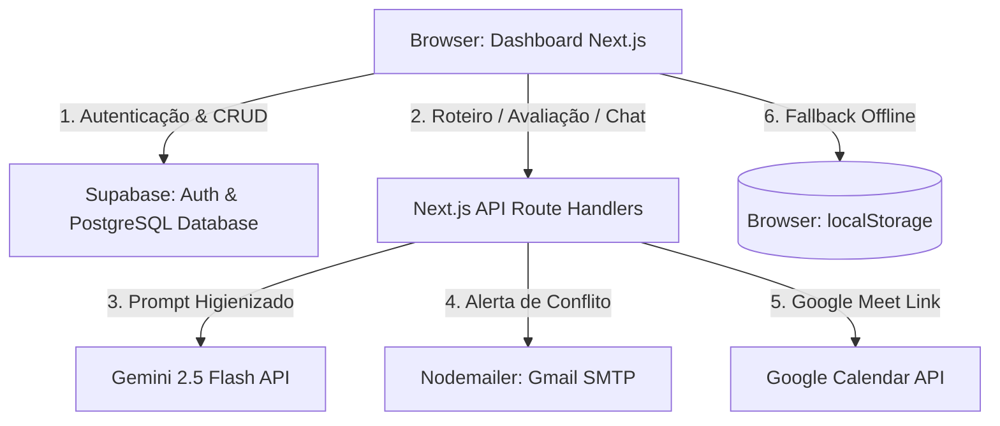

# Guia e Blueprint de Arquitetura do Projeto - SyncHR (Smart Leading)

Este documento consolidado serve como a especificação de engenharia, produto e compliance mais detalhada do ecossistema **SyncHR (Smart Leading)** da Clear IT. Ele descreve a estrutura de código real, as tecnologias utilizadas, as regras de negócio, as conformidades regulatórias, os comandos padrões e a jornada cronológica de uso de ponta a ponta.

---

## 1. Visão Geral do Produto e Objetivos Estratégicos

O **Smart Leading (Clear One IA)** é o copiloto de inteligência artificial corporativo da Clear IT, criado em 2026 para responder ao tema estratégico anual **"Adaptabilidade, Performance e Resultado"**. 

Ele atua nas seguintes dores:
*   **eNPS e Engajamento:** Reverter a queda na dimensão "Liderança e Confiança" diagnosticada na pesquisa de clima 2025/2026.
*   **Distribuição Geográfica:** Conectar gestores e colaboradores distribuídos entre Manaus, São Paulo, Brasília, Rio de Janeiro, Salvador e Santa Catarina por meio de conversas de feedback e 1:1s frequentes.
*   **Maturidade de Gestão:** Apoiar líderes na condução de conversas difíceis (desalinhamento, performance) e na formulação de Planos de Desenvolvimento Individual (PDIs) assertivos.
*   **Visibilidade de Dados:** Trazer centralização e transparência das interações para o RH da Clear IT (Gerente Priscila Bacelar), eliminando o "improviso sistemático" e os registros perdidos.

---

## 2. Estrutura de Arquivos e Componentes do Repositório

O projeto adota o padrão **Onion Portable**, organizando as camadas lógicas entre especificações de negócio legíveis e a aplicação web Next.js 14 funcional integrada ao Supabase.

```text
SyncHR/
│
├── .env.local                          # Variáveis de ambiente (Supabase, Resend, Gmail SMTP e Gemini API)
├── .gitignore                          # Exclusões de builds, node_modules e arquivos locais
├── LICENSE                             # Licença MIT do projeto
├── ONION-MASTER-PROMPT.md              # O Cérebro Orquestrador - Regula as personas da IA (@pm, @frontend, @backend, etc.)
├── README.md                           # Instruções gerais de instalação e inicialização rápida
├── PROJECT-GUIDE.md                    # Este arquivo - O Blueprint mestre do projeto atualizado
├── presentation.html                   # Apresentação de slides interativa da metodologia Onion e do Smart Leading
├── components.json                     # Arquivo de configuração de componentes shadcn/ui
├── next-env.d.ts                       # Declarações globais de tipos do Next.js
├── next.config.js                      # Configuração geral do Next.js
├── package.json                        # Scripts npm, dependências e configurações do projeto
├── package-lock.json                   # Detalhamento de árvore de dependências instaladas
├── postcss.config.js                   # Configuração de processamento de estilos PostCSS
├── tailwind.config.js                  # Configurações do framework Tailwind CSS (design tokens e cores)
├── tsconfig.json                       # Configurações de compilação estrita do TypeScript
│
├── docs/                               # Pasta Centralizadora de Contexto de Desenvolvimento
│   ├── business-context-lite.md        # Especificações de Produto (@pm): Histórias de usuário, Critérios de Aceite e RNs
│   ├── technical-context-lite.md       # Arquitetura de Engenharia (@backend/@frontend): Mocks, local storage e PoCs
│   ├── business-technical-lite.md      # Consolidação unificada de MVP para apresentação comercial com o RH
│   ├── onion-cycles.md                 # Instruções e fluxogramas dos Ciclos de Desenvolvimento Onion
│   │
│   ├── knowledge-base/                 # Artigos de Pesquisa e Bases de Conhecimento (@meta)
│   │   ├── business-rules-persona.md   # Regras de negócios específicas e personas da liderança
│   │   ├── one-on-one-and-feedback-methodologies.md # Padrões de feedback (SBI, GROW) e perfis de liderança
│   │   └── disc-and-lgpd-compliance.md              # Pesquisa sobre perfis DISC e regras de conformidade LGPD
│   │
│   └── sessions/                       # Logs históricos de desenvolvimento do projeto
│       ├── README.md                   # Índice cronológico das sessões de trabalho realizadas
│       └── TEMPLATE.md                 # Estrutura padrão de relatório de sessão
│
├── scratch/                            # Rascunhos e scripts executáveis de validação
│   ├── schema.sql                      # DDL do banco de dados (tabelas, triggers e RLS do Supabase)
│   └── setup-supabase.js               # Script Node para sincronização do banco com o banco Supabase
│
└── src/                                # Código-fonte da aplicação Next.js
    ├── app/                            # Estrutura de rotas do Next.js (App Router)
    │   ├── api/                        # Handlers/Rotas de APIs Backend (Serverless)
    │   │   ├── chat/                   # Rota de chat do Live Assist (Gemini API)
    │   │   ├── create-user/            # Rota para criação rápida de usuários
    │   │   ├── evaluate/               # Rota de avaliação pós-1:1 (cálculo de consistência e resumo por IA)
    │   │   ├── generate-script/        # Rota de geração automatizada de roteiro 1:1 por IA
    │   │   ├── inbound/                # Rota de processamento de e-mails inbound (transcrições do Google Docs)
    │   │   ├── send-email/             # Rota para disparo de e-mails via Nodemailer
    │   │   └── sync/                   # Rota de sincronização de reuniões locais com o banco corporativo
    │   │
    │   ├── feedback/                   # Página do Colaborador (Validação de atas e sign-off bilateral)
    │   │   └── page.tsx                # Tela interativa de feedback do liderado
    │   ├── login/                      # Página de Autenticação
    │   │   └── page.tsx                # Tela de Login com suporte a contas mockadas e login via Google OAuth
    │   ├── privacidade/                # Página de conformidade legal
    │   │   └── page.tsx                # Termos de uso e políticas de privacidade LGPD
    │   ├── globals.css                 # Estilos globais Tailwind e customizações visuais de fontes
    │   ├── layout.tsx                  # Layout raiz e injeção de fontes corporativas (Outfit, Space Grotesk)
    │   └── page.tsx                    # Painel/Dashboard principal do Smart Leading (Console unificado)
    │
    ├── lib/                            # Abstrações de bibliotecas utilitárias e conectores externos
    │   ├── gemini.ts                   # Integração direta com os modelos do Google Gemini 2.5 Flash
    │   ├── google-calendar.ts          # Gerenciamento de eventos de calendário e Meet via Google Calendar API
    │   ├── resend.ts                   # Conector de e-mail (encapsulando Nodemailer SMTP do Gmail)
    │   ├── storage.ts                  # Gerenciador híbrido de dados (LocalStorage + Supabase Client)
    │   ├── supabase.ts                 # Conector cliente oficial do Supabase
    │   └── utils.ts                    # Utilitários de interface (ex: cn wrapper para Tailwind)
    │
    └── types/                          # Definições estritas de tipos do sistema
        └── index.ts                    # Interfaces compartilhadas (Leader, Collaborator, OneOnOne, Conflict, etc.)
```

---

## 3. Arquitetura Tecnológica e Fluxo de Dados

A arquitetura do SyncHR utiliza um ecossistema moderno baseado em computação serverless do Next.js 14 e Supabase, oferecendo alta performance e proteção de dados em tempo de execução:



### Detalhamento da Stack:
1.  **Next.js 14 (App Router):** Habilita renderização de componentes dinâmicos do lado do cliente com segurança integrada por trás de Route Handlers (`src/app/api`).
2.  **Supabase Auth & Database:** Fornece a persistência relacional do ecossistema por meio de tabelas seguras sob RLS (Row Level Security): `profiles`, `collaborators`, `one_on_ones` e `conflicts`.
3.  **Google Gemini 2.5 Flash:** Motor principal de IA encarregado de calibrar os roteiros ao perfil do líder, orientar diálogos em tempo real e auditar a consistência bilateral.
4.  **SMTP Gmail (Nodemailer):** Dispara e-mails de alerta críticos de conflito do canal corporativo diretamente para a Gerente de RH Priscila Bacelar.
5.  **Google Calendar API:** Integrada via login Google OAuth para geração automatizada de salas de reunião de Google Meet.
6.  **Dual Storage Manager (`src/lib/storage.ts`):** Garante a resiliência da aplicação. Se a conexão com o Supabase falhar, lê e grava de forma síncrona no `localStorage` do navegador.

---

## 4. Subagentes Especialistas do Onion Master Prompt

O desenvolvimento e a manutenção do SyncHR são divididos entre subagentes com focos especializados:

*   **@pm / @po (Planejador / Product Manager):** Foca em planejar "O que e por quê" (priorização de backlog, dores do cliente, histórias de usuário, requisitos funcionais e o onboarding estruturado de líderes/colaboradores).
*   **@frontend / @front (Desenvolvimento Frontend):** Foca em UI/UX, boas práticas de layout (responsividade, grid, flexbox, consistência visual) e acessibilidade na web (diretrizes WCAG, tags ARIA, contraste cromático apropriado e navegação por teclado).
*   **@backend / @back (Desenvolvimento Backend):** Foca na modelagem lógica, banco de dados relacional (`Supabase`), integrações de APIs externas (Nodemailer, Google APIs, Gemini) e lógica de dados.
*   **@security / @sec (Segurança da Informação):** Foca em privacidade, conformidade LGPD, higienização de inputs contra PII (dados pessoais identificáveis) e dados de saúde sensíveis, além de qualidade de código defensiva (regras OWASP).
*   **@testing / @qa (Qualidade e Testes):** Foca em planos de testes automatizados e validações limite de regras de negócio.
*   **@validator / @audit (Auditor de Validações):** Persona integradora que audita sistematicamente todas as camadas de validação (frontend, backend, testes de QA e cybersecurity).

---

## 5. Jornada Cronológica de Uso e Fluxos Detalhados

A usabilidade do sistema segue uma ordem cronológica precisa, desde a preparação inicial da liderança até a governança de dados do RH.

### Passo 1: Autenticação e Provisão (Login)
*   O usuário acessa `/login`. Ele pode entrar usando e-mail corporativo ou fazer login social com o Google.
*   **Contas Mocks:** Ao digitar a conta de RH da Priscila (`rh.priscila@clearit.com.br` / `rh123456`), o sistema realiza o auto-cadastro no Supabase de forma transparente caso a conta ainda não exista, provisionando seu registro associado na tabela pública `profiles`.

### Passo 2: Onboarding Estruturado do Líder (F-01)
*   No primeiro login, o líder é redirecionado para a tela de Onboarding.
*   Ele seleciona seu cargo atual (Ex: Coordenador $\rightarrow$ Gerente) e responde a um teste rápido de 3 perguntas.
*   O resultado categoriza seu perfil em:
    *   **TÉCNICO:** Roteiros curtos, sem jargões corporativos, focando em blockers e entregas.
    *   **EM TRANSIÇÃO:** Guias passo a passo baseados na metodologia SBI e inteligência emocional.
    *   **ENGAJADO:** Tópicos rápidos e acionáveis focados em PDI em menos de 3 minutos.
*   Os dados são gravados localmente e atualizados na tabela `profiles` do Supabase.

### Passo 3: Preparação da Reunião e Geração de Roteiro (F-02 & F-03)
*   O líder entra na aba de Copiloto, escolhe o colaborador a ser atendido e define o tipo de reunião (Quinzenal, PDI, Alinhamento).
*   O sistema carrega o badge DISC do liderado (cadastrados por padrão ou gerenciados pelo RH) e propõe tópicos iniciais adaptados:
    *   **Dominantes (D):** Foco em autonomia, velocidade de entrega e desafios técnicos.
    *   **Influentes (I):** Foco em engajamento, clima de time e visibilidade de resultados.
    *   **Estáveis (S):** Foco em previsibilidade, bem-estar mental e processos contínuos.
    *   **Analíticos (C):** Foco em cobertura de testes, qualidade de código e dados estruturados.
*   O líder descreve o contexto da reunião e clica em **Gerar Roteiro**. O backend `/api/generate-script` consulta a API Gemini 2.5 Flash, mesclando o estilo do líder, o DISC e o nível de maturidade do colaborador (L1 a L4), gerando um roteiro estruturado com tarefas de plano de ação (Kanban) e propostas de reajuste de prazo se houver atrasos reportados.

### Passo 4: Condução da 1:1, Live Copilot & Speech Timer (F-03 & F-04)
*   Durante a conversa, o líder pode iniciar o cronômetro para medir o tempo decorrido de diálogo.
*   O painel calcula a divisão de fala entre líder/liderado para manter a meta da **Regra 70/30** (colaborador deve falar 70% do tempo).
*   **Live Assist Chat:** Se o liderado trouxer uma resposta complexa, o líder pode digitar no chat da tela e o endpoint `/api/chat` gera 2 a 3 sugestões imediatas de perguntas empáticas utilizando a API Gemini.
*   **Integração Google Meet:** O líder pode habilitar a geração de link automático de videoconferência do Meet através da integração do Google Calendar.

### Passo 5: Registro da Ata e Higienização LGPD (F-06)
*   Ao encerrar, o líder insere suas notas da reunião (Raw Leader Notes) e a transcrição bruta da conversa.
*   **Sanitização Automática:** Antes de salvar, o sistema higieniza dados identificáveis (CPFs, e-mails) e filtra palavras sensíveis de saúde ("doença", "atestado") em conformidade com as regras de compliance (RN09).
*   O líder salva o registro, gerando uma ata pendente de assinatura na tabela `one_on_ones`. Um e-mail de notificação é disparado simulando o envio da ata ao colaborador.

### Passo 6: Validação Bilateral e Assinatura Digital
*   O colaborador recebe o link exclusivo da ata `/feedback?id=UUID`.
*   Ele acessa a página, revisa o resumo de combinados (Aba 1) e o plano de metas/Kanban sugerido (Aba 2).
*   Na Aba 3, o colaborador insere suas próprias notas/comentários (Raw Collaborator Notes).
*   Na Aba 4, ele clica em **Validar e Assinar**, registrando seu consentimento sob as diretrizes de compliance (RN01) no Supabase.

### Passo 7: Auditoria por IA e Detecção de Conflitos (F-05 & F-06)
*   Imediatamente após a assinatura do colaborador, a rota `/api/evaluate` é executada. A IA processa de forma integrada as notas brutas do líder, as notas brutas do colaborador e a transcrição.
*   Ela analisa a consistência bilateral de percepções e gera:
    *   **Score de Alinhamento:** Índice numérico (0-100) que indica concordância mútua de combinados.
    *   **Resumo Unificado Final:** Síntese profissional unindo as perspectivas.
    *   **Detecção de Conflito:** Caso identifique queixas de atrito severo, sobrecarga excessiva sem plano ou desalinhamento explícito de metas.
*   Se um conflito for detectado (`hasConflict: true`), o sistema:
    1.  Cria automaticamente um protocolo de conflito (`SHR-2026-XXXXXX`) sob o status `PENDING` na tabela `conflicts`.
    2.  Dispara um alerta urgente por e-mail (via Nodemailer Gmail SMTP) para Priscila Bacelar (RH) contendo os detalhes do conflito e link de investigação.

### Passo 8: Painel do RH e Mediação (F-06)
*   Priscila Bacelar (RH) acessa o dashboard administrativo (área visível apenas para perfis de administrador/RH).
*   Ela visualiza indicadores gerais: volume de 1:1s, eNPS estimado da organização e o andamento das lideranças.
*   Na aba de **Gestão de Incidentes**, o RH acompanha os conflitos abertos pelo motor de IA. Ela pode:
    *   Alterar o status de `PENDING` para `IN_INVESTIGATION` ao iniciar conversas bilaterais.
    *   Registrar notas de mediação confidenciais.
    *   Finalizar casos marcando-os como `RESOLVED` ou `UNRESOLVED`.

### Passo 9: Central de Configurações de Prompts (Admin Fine-Tuning)
*   O painel administrativo do RH permite editar as instruções de sistema globais da IA (Prompts do Gerador de Roteiro e do Chat Live Assist).
*   As alterações são salvas na tabela de configurações e aplicadas instantaneamente em todas as novas requisições da plataforma.

---

## 6. Comandos Padrões de Execução e Testes

Para gerenciar o ciclo de desenvolvimento Onion no ambiente local, utilize os seguintes comandos do terminal baseados no npm:

### A. Rodar o Projeto Localmente
*   **Instalar Dependências:**
    ```bash
    npm install
    ```
*   **Iniciar Servidor de Desenvolvimento:**
    ```bash
    npm run dev
    ```
    *(Inicia a aplicação Next.js localmente no endereço http://localhost:3000 com suporte a hot-reload).*
*   **Compilar para Produção (Build):**
    ```bash
    npm run build
    ```
*   **Iniciar Servidor de Produção Compilado:**
    ```bash
    npm run start
    ```

### B. Configuração e Sincronização do Banco de Dados
*   **Sincronizar DDL e Schema SQL com o Supabase:**
    ```bash
    node scratch/setup-supabase.js
    ```
    *(Executa o arquivo `scratch/schema.sql` no banco de dados do Supabase configurado via string de conexão do PostgreSQL).*

### C. Qualidade e Testes de Código
*   **Executar Verificação Estática de Lints (ESLint):**
    ```bash
    npm run lint
    ```
*   **Rodar Testes Isolados de Negócio (RN01, RN02 e LGPD):**
    ```bash
    node scratch/poc-test-logic.js
    ```
